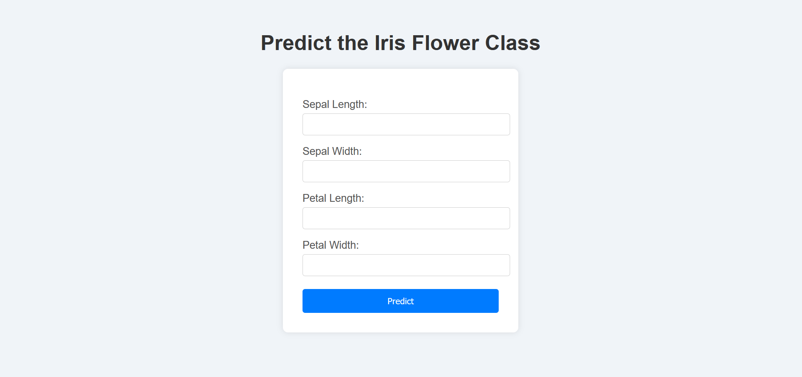

# Iris Flower Classification Web App

A simple Flask-based web application that predicts the species of an Iris flower based on user input. The model uses sepal and petal dimensions to classify the flower into one of three classes: Setosa, Versicolor, or Virginica.


## Features


- Input fields for Sepal Length, Sepal Width, Petal Length, Petal Width
- Predicts the Iris species using a pre-trained machine learning model
- Styled HTML interface for ease of use
- Packaged with Docker and integrated with Jenkins for CI/CD


## Tech Stack

- Python
- Flask
- Scikit-learn
- HTML/CSS
- Docker
- Jenkins


## Demo

1. **Clone the Repository**
   ```bash
   git clone https://github.com/mehardeep88/mlops.git
   cd mlops

2. **Run docker-compose**
    ```bash
    docker-compose up --build

3. **Access the Web App**
 Navigate to 
 ```bash
  http://127.0.0.1:5000/ 
  ```
  in your browser.

## Screenshots



## Authors

- [@mehardeep88](https://www.github.com/mehardeep88)
- [@kiran7778](https://www.github.com/kiran7778)
- [@InderjeetKaur26](https://www.github.com/InderjeetKaur26)


